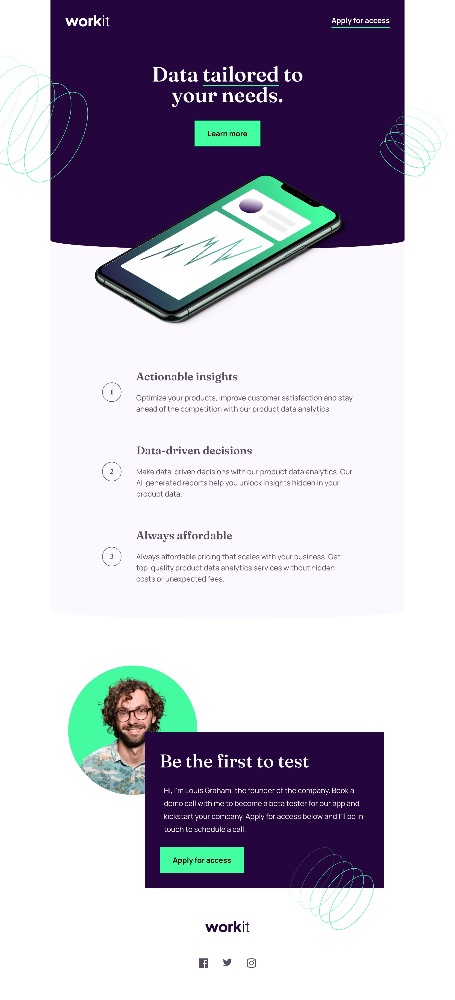
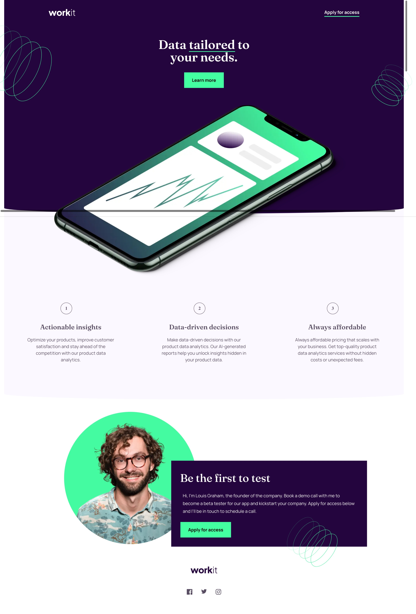

# Frontend Mentor - Workit landing page solution

This is a solution to the [Workit landing page challenge on Frontend Mentor](https://www.frontendmentor.io/challenges/workit-landing-page-2fYnyle5lu). Frontend Mentor challenges help you improve your coding skills by building realistic projects. 

## Table of contents

- [Overview](#overview)
  - [The challenge](#the-challenge)
- [My process](#my-process)
  - [Built with](#built-with)
  - [What I learned](#what-i-learned)
  - [Continued development](#continued-development)
- [Screenshots](#screenshot)

**Note: Delete this note and update the table of contents based on what sections you keep.**

## Overview

### The challenge

Users should be able to:

- View the optimal layout for the interface depending on their device's screen size
- See hover and focus states for all interactive elements on the page

### Links

- Solution URL: [Github](https://github.com/arfernn/working-landing-page)
- Live Site URL: [Github pages](https://arfernn.github.io/working-landing-page/)

## My process

### Built with

- Semantic HTML5 markup
- CSS custom properties
- Flexbox
- Mobile-first workflow

### What I learned

I learned how to use pseudoelements in this project. In this case, they are used to create the fancy border effect in the background colors. 

I've used media queries for the first time here as well. I did all the development first for mobile, then added the extra tags using media queries. Trying to keep it as less messy as possible.

Also, I had some trouble with the man's picture which overlaps with the squared section in some places. First I used relative positions for both elements, but then I realized that when you use the relative position you can apply a negative shift with e.g. top. But this will only change the offset of the content, while the box containing it remains in the same place. 

This creates an invisible padding with following elements, that can only be fixed by using position:absolute instead, apparently.

Ah! it was the first time I customized the underline in a text element. 

### Continued development

I've used absolute positioning in multiple places here. And in the responsive mode of my desktop browser (edge) seems to work well. However, when I use my actual smartphone to access the page, the offsets are a bit broken. I need to revisit this and learn better why some browsers or platforms seem to render this differently.

## Screenshot

